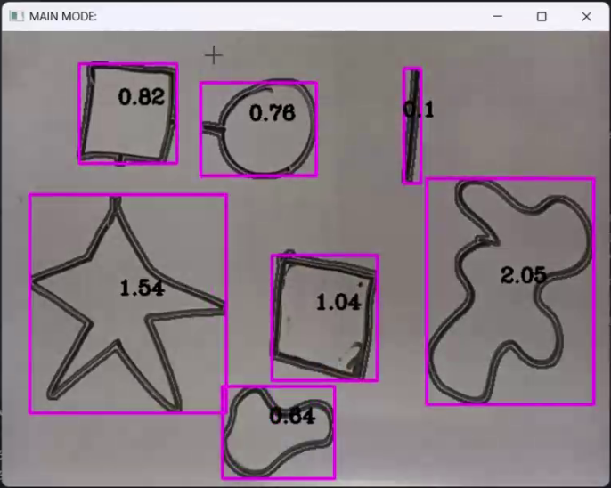
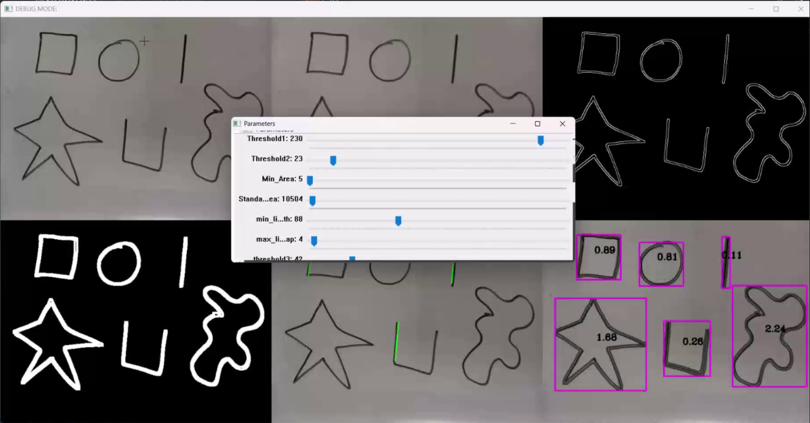
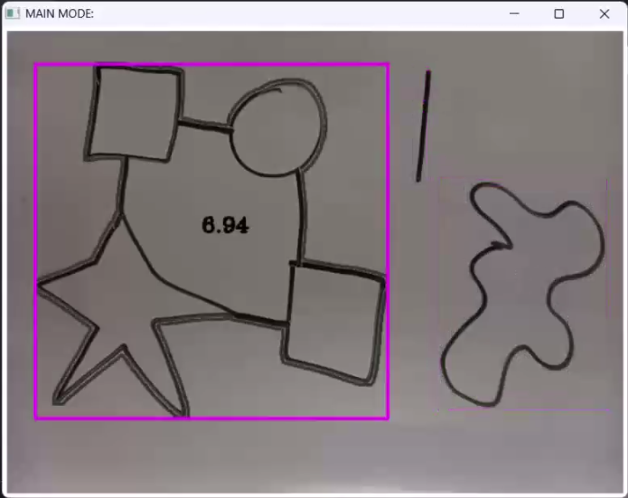
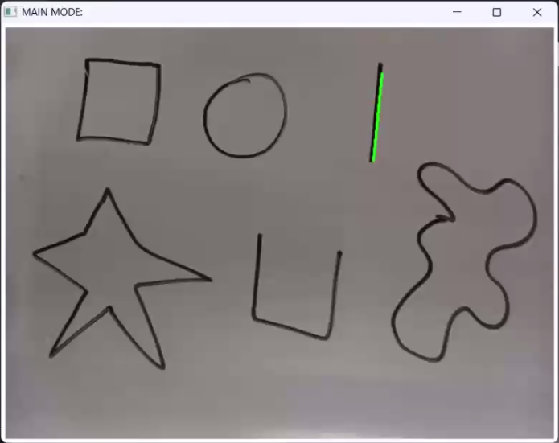

# Geometric Shapes Area Calculation System using Raspberry Pi

This project designs and implements a simple system for calculating the area of geometric shapes. The system includes a Raspberry Pi board, a camera, and an LCD display, and it uses image processing to automatically detect and calculate the area of different shapes. The use of simple hardware and modern image processing techniques makes this system efficient and applicable in various environments.

## Authors
- AmirMahdi Tahmasebi - 402106178
- AmirHossein Mirzaei - 402106661
- MohammadMahdi Rajabi - 402106015
- AmirHossein MohammadZadeh - 402106434

## Initial Setup

To simplify the development process, we initially decided to run the software on a personal computer. After ensuring its proper functionality, we transferred it to the Raspberry Pi board. This approach allowed us to quickly test the code and make necessary changes as needed.

## Windows

The software includes 4 main windows, each with a specific functionality:

1. **Main Window**:
   - Access with the M key
   - In this window, a live image from the camera is displayed, and necessary processing is done on it. Geometric shapes present in the image are identified, and a contour is drawn around each shape. Additionally, the area of each shape is displayed numerically on the image.
   - This window serves as the starting and main point of the software, providing a comprehensive and live view of the identified shapes and their respective areas.
   

2. **Debug Window**:
   - Access with the D key
   - This window allows the user to view different modes of the camera image, including the original image, image with various filters such as edge detection, and the black-and-white image. In this window, you can also change settings related to contour detection, such as edge detection sensitivity and minimum contour area.
   - Settings for the reference line can also be edited in this section. Changes made in this window are displayed live on the image, helping the user optimize image processing parameters.
    

3. **Reference Area Selection Window**:
   - Access with the S key
   - Upon entering this window, all shapes present in the image are identified. You can then use the R and L keys to navigate between shapes and finally press the Enter key to select one as the reference for area calculation.
   

4. **Reference Line Selection Window**:
   - Access with the N key
   - Upon entering this window, a photo is taken from the camera, and all lines in the image are identified. You can then use the R and L keys to navigate between lines and finally press the Enter key to select one.

   
   
## Customization

In the constructor of the code, you can customize the source of the image. You can specify whether the image should be read from a URL, a saved file, or directly from the device camera. This feature provides the flexibility to use different image sources.

## Exiting the Program

You can always exit the program by pressing the Q key.

By combining a Raspberry Pi, a camera, and image processing techniques, this system has provided an efficient method for measuring the area of geometric shapes. It has various applications in different environments and can significantly aid in tasks requiring quick and precise measurements.
